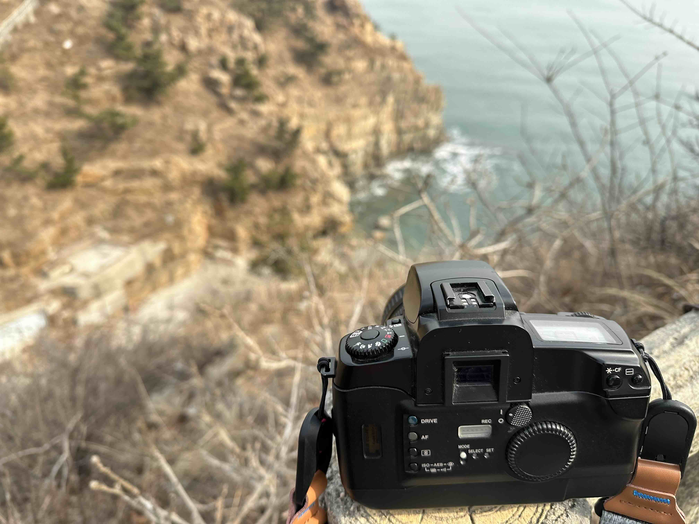
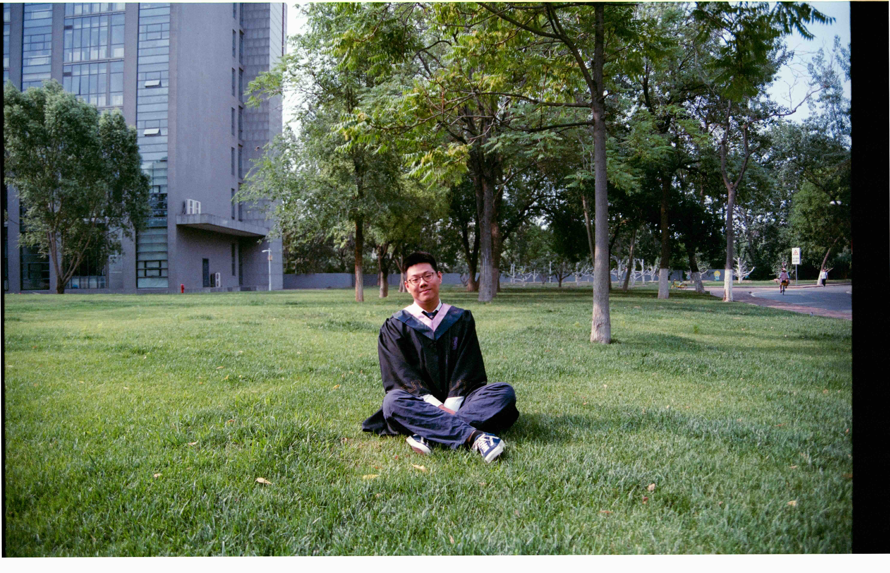
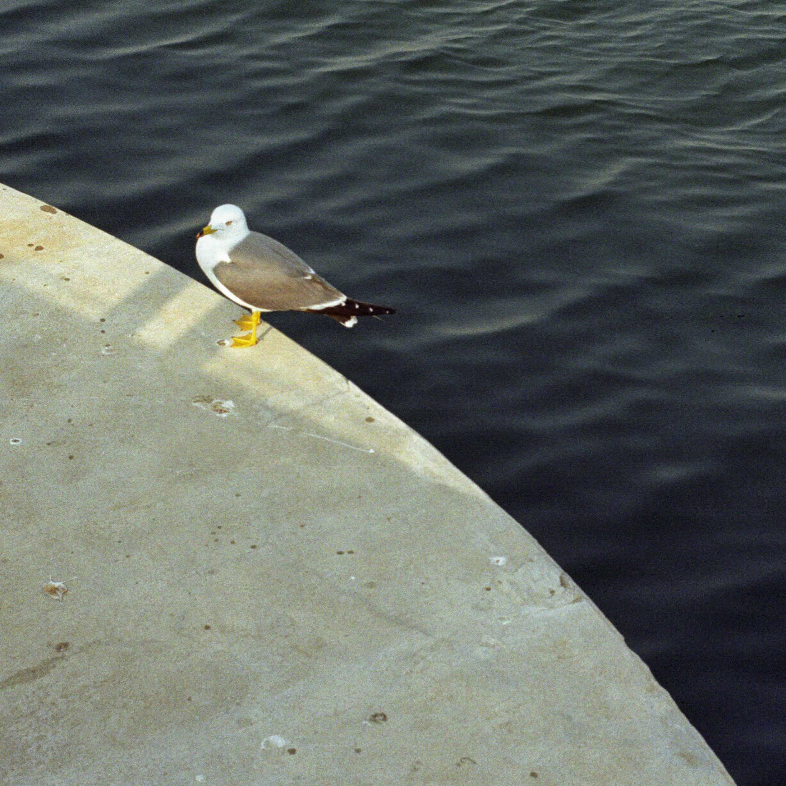
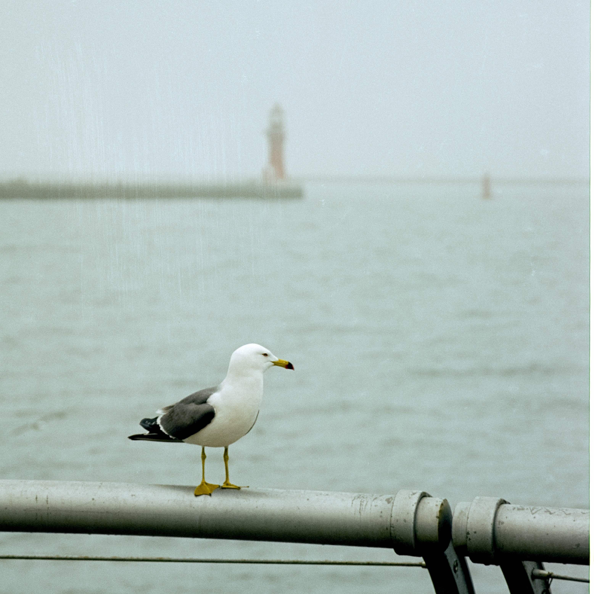

## Film Photography

A photo of my trustworthy EOS 5 Film Camera during a casual hike.

Myself at graduation ceremony day. Shot with Fujifilm Superia Premium 400 Film. Sadly the exposure is a bit off so my face is abnormally red, one of the interesting characterisitics with this type of film.

Shot in Dalian, China with Kodak Gold 200 Film. 

Shot in Dalian, China with Kodak Vision 3 5207 250D Film on a cloudy day. 